# Predicting Song Popularity

## Introduction
Predicting song popularity is particularly important in keeping businesses  competitive  within  a  growing  music  industry.  There are multiple factors that affect a song’s popularity that can be both related and unrelated to a song’s musicality, from the key and modality in which it’s written, to the name of the artist, year of release, and type of marketing campaign. But  what  exactly  makes  a  song  popular?  Starting  with the  Spotify  Songs  Dataset,  a  collection  of  audio  features  and metadata  for  huge number of  songs,  we attempted to build machine learning models to predict a song’s popularity based only on its musicality features. We  also evaluated different algorithms on their ability to  predict  popularity  and  determined  the  types  of  features  that hold  the  most  predictive  power.  

## Table of Contents
- Motivation and Problem Statement
- Data Collection
- Data Analysis 
- Model Development and Application 
- Text Analysis
- Conclusions and Discussion

## 1. Motivation and Problem Statement
- **Motivation**
  - Music has been an integral part of our culture all through-out  human  history. In 2017, the music industry generated $8.72 billion in the United States alone. Of this $8.72 billion, the majority of the revenue is generated by popular, mainstream songs. Thanks to growing streaming services (Spotify, Apple Music, etc.) the industry continues to flourish. Popular songs secure the lion’s share of revenue. The top 10 artists in 2016 generated a combined $362.5 million in revenue. Therefore, having a fundamental understanding of what makes a song popular has major implications to businesses that thrive on popular music, namely radio stations, record labels, and digital and physical music marketplaces. Besides, the  ability  to  make  accurate  predictions  of  song  popularity  also  has  implications  for  customized  music  suggestions. Predicting  popular  songs  can  be  applied  to  the  problem  of predicting preferred songs for a given population.

- **Problem Statement**
  - Every song has key characteristics including lyrics, duration, artist information, temp, beat, loudness, chord, etc. The aim of this project is to investigate the following questions: 

    - Are there certain characteristics for popular songs?
    - What are the largest influencers on a song’s success?
    - Is it possible to predict popular songs with machine learning using audio features? What is the best performance of our machine learning models?

If there’s one thing I can’t live without, it’s music. I love music and especially pop music. My inspiration for this project is finding out what it is about a song that I enjoy so much.

## 2. Data Collection
- **Data Source**
  - It can be worth mentioning what The Echo Nest is, since many of the related works used this for obtaining data about audio features. The Echo Nest is a leading music intelligence company that has over a trillion data points on over 38 million songs in its database. In 2014, Spotify announced that they had acquired The Echo Nest. Some of the audio features derived by The Echo Nest for audio tracks are still available through the Spotify API. The dataset of audio features used in this project is from Kaggle Dataset, which is fetched from Spotify’s Web API. 

  - Spotify for Developers offers a wide range of possibilities to utilize the extensive catalog of Spotify data. One of them are the audio features calculated for each song and made available via the official Spotify Web API. Each song from Spotify API has values for artist name, track name, track id and the audio features itself. 

  - There are several datasets on Kaggle published in the past containing similar data. In this project we chose data Collected on December 2018 as this dataset is the biggest one (more than 116k unique songs). Therefore, combined all the information we have got, this dataset met our criteria (good and “professional” data source, audio features with high variety, etc.), and hence is chosen for my project.

- **Audio Features Change Over Time**
  - We need to keep in mind that the audio features of hit songs differ over the decades and the results for our project may not stand for the trend of popular songs forever. To visualize this, Minna and Philippa created diagrams in which they plotted how the different features for song tracks has changed over time. The data is based on the Billboard Hot 100 tracks from 1951 until today, and the audio features are fetched from the Spotify API.

## 3. Data Analysis 
- **Basic Data Summary**
  - The original dataset contains audio features for 116k tracks collected from the official Spotify Web API. In this project, we used a subset of the Spotify songs dataset (10000 tracks). The subset included the following 17 attributes taken directly from the Spotify API (for detailed explaination of each variable, please check the file "data_description.txt"):

The first step is to get the training and testing dataset. The original dataset has dimension of 116372 * 17. We use a subset of the original data as our training (5000 records) and testing (5000 records) datasets. From the two datasets, we can see that they contain a wide variety of information that might be useful in understanding the song’s popularity. They also includes a record of popularity for each song. Our goal is using the final model generated and testing data to predict the class of a song’s popularity (given the song’s features).

From the summary results, we find both the two datasets have some artists that showing more than one time. Each song name in the datasets should be unique. Different numerical variables have different ranges, but most of them have range of [0, 1] (as defined in data dictionary).

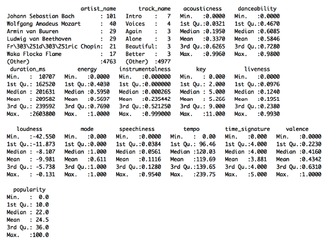

- **Features Distribution**
  - We now have a basic idea about the data. We need to extend that with some visualizations to take a better look at the distribution for our numerical features.
  - From figure below, we can conclude:
    - Most of the songs are not acoustic (i.e. classical music)
    - Most of the songs are not recorded during concert: liveness distribution closed to 0
    - Most of the songs have lyrics: speechiness distribution close to 0
    - Songs are pretty fast: BPM distribution has mean ~120

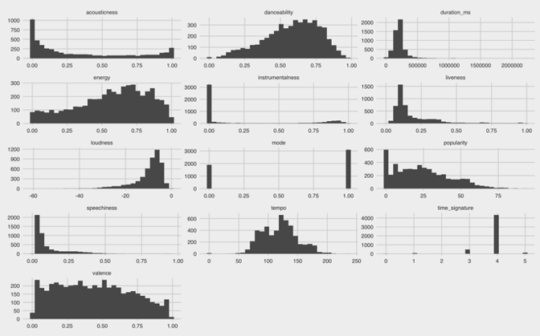

- **Features Correlations**
  - We used training data to create a correlation matrix to discover the correlation between features of songs. Figure below shows that our predictor variables are generally independent, except for a strong positive correlation between loudness and energy, and a strong negative correlation between energy and acousticness. The solution to this mild lack of independence is therefore straightforward: we drop the energy variable from our dataset. Besides, from the plot we can also find that the difficulty here is that there is not much dependence of the song popularity with other features. 

  - By calculating correlation coefficients, we found top 5 features with highest correlation with songs popularity are:

    - Loudness: The higher the overall loudness of a track in decibels (dB), the more popular of the song.
    - Instrumentalness: The greater likelihood the track contains vocal content (e.g. rap or spoken word tracks), the more popular of the song.
    - Danceability: The more suitable a track is for dancing, the more popular of the song.
    - Energy: The more energetic the tracks (e.g. fast, loud, and noisy), the more popular of the song.
    - Acousticness: The less the track is acoustic, the more popular of the song.

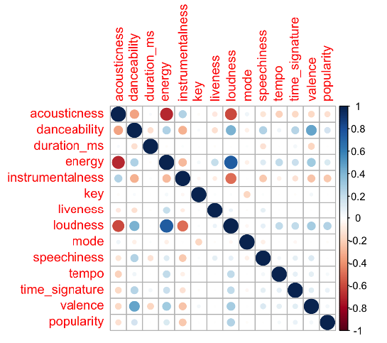  

- **Feature Preparation & Creation**
  - In this section, we first drop the energy variable, and then create a new dataset with variables: artist_name, track_name and popularity. Save this dataset for later text analysis. Then drop the artist_name and track_name variables in training and testing datasets since they are not suitable for modeling part. 

  - For duration_ms, convert duration to secondes (unit in milliseconds are like 106 and can have an impact during model training, if not renormalized). By analyzing the meaning and data types of the independent variables, it can be seen that some numeric variables that have special meaning (key, time_signature) should be transformed into categorical variables. For the mode variable, from the histogram we find it contains binary values, combined with its special meaning, we transfer the two values into “major” and “minor”.

  - The most important part for feature creation is, based on the values in popularity variable, we create a new variable - popularity_new and use 20 and 50 as cutoffs (we choose the cutoffs based on the histogram of popularity variable in the training dataset) to divide the popularity into three classes: liked/disliked/neutral. The criteria for the feature creation is:

    - If popularity <= 20, popularity_new = “dislike”
    - If 20 < popularity <= 50, popularity_new = “neutral”
    - If popularity > 50, popularity_new = “like”

  - Finally, check structure of the training dataset (figure below). Now we have 4 categorical variables. The new variable popularity_new will be our target variable during the modeling process.

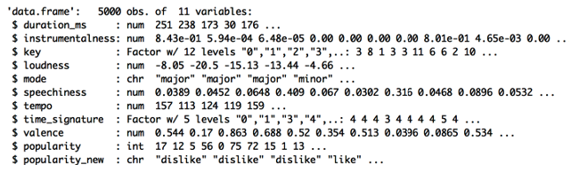 

- **Outliers**
  - We use boxplot as main tool to detect and remove outliers. We mainly do the outlier detection on the top 4 independent variables (since we removed energy variable) that have highest correlation with our target variable. The boxplots are shown below.

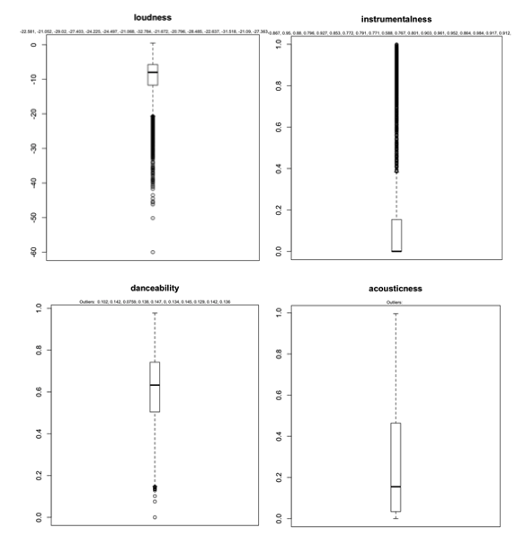 

  
- **Feature Transformation**
  - In this section, to be better prepared for modeling, we first scale the numerical variables in both training and testing datasets, then create dummy variables for the categorical independent variables.

## 4. Model Development and Application 
- **Preparation for Modeling**
  - Before developing models, we need to split the training data into train part (75%) and test (25%) part. 

  - We will use 10-fold cross validation to estimate model fit. This will split our dataset into 10 parts, train in 9 and test on 1 and release for all combinations of train-test splits. We will also repeat the process 3 times for each algorithm with different splits of the data into 10 groups, in an effort to get a more accurate estimate. 

  - Model Tuning: The caret R package provides a grid search where it or we can specify the parameters to try on our problem. It will trial all combinations and locate the one combination that gives the best results. There are two ways to tune an algorithm in the Caret R package, the first is by allowing the system to do it automatically. This can be done by setting the tuneLength to indicate the number of different values to try for each algorithm parameter. Here we use the automatic grid search of the size and k attributes with 5 (tuneLength=5) values of each.
  
  - We are using the metric of “Accuracy” to evaluate models. This is a ratio of the number of correctly predicted instances in divided by the total number of instances in the dataset multiplied by 100 to give a percentage (e.g. 95% accurate). We will be using the metric variable when we build and evaluate each model next.

- **Building Models**
  - Since our target variable popularity_new is categorical, this should be a classification problem. We randomly choose 4 popular algorithms that are used for classification problems and add the Linear Discriminant Analysis for comparison:

    - Linear Discriminant Analysis (LDA)
    - Support Vector Machines (SVM)
    - Decision Trees (CART)
    - Random Forest (RF)
    - k- Nearest Neighbor (kNN)
    
  - This is a good mixture of simple linear (LDA), nonlinear (CART, kNN) and complex nonlinear methods (SVM, RF). We reset the random number seed before reach run to ensure that the evaluation of each algorithm is performed using exactly the same data splits. It ensures the results are directly comparable.

- **Model Evaluation**
  - From figure below (left), we can see the accuracy of each classifier and also other metrics like Kappa. 

  - We also created a plot of the model evaluation results and compare the spread and the mean accuracy of each model (figure on the right). There is a population of accuracy measures for each algorithm because each algorithm was evaluated 10 times (10 fold cross validation).

  - Overall, there are not much difference of accuracy among the 5 classifier and all the accuracy is not very high. Accuracy of random forest and Linear Discriminant Analysis are pretty close and they are the top two classifiers with the highest accuracy. 

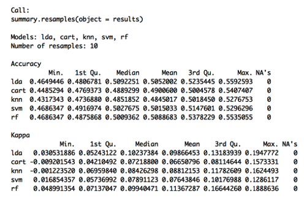 

 

- **Model Optimization**
  - From our initial trial results, we find the accuracy for our models are not good. In order to optimize our model, we only choose predictors that are highly correlated with our target variable. Here we choose the top 5 highest correlation coefficients variables: loudness, instrumentalness, danceability, acousticness, time_signature and use them as input for our models, then use the same code to train our models. From figures below we can see that there are not much change in overall model accuracy, and LDA has the best performance.

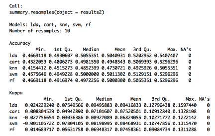 

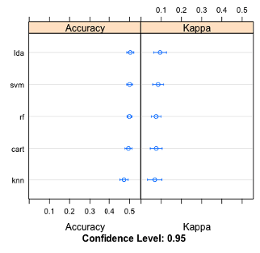 

- **Making Predictions**
  - From the previous results we can know the LDA was the most accurate model. Now we want to get an idea of the accuracy of the model on our validation set. This will give us an independent final check on the accuracy of the best model. We run the LDA model directly on the validation set and summarize the results in a confusion matrix (accuracy is 52.38% with 95% confidence)

  - Next, we use LDA model generated using only part of variables to make prediction and find that the accuracy this time decreased to 49.94% with 95% confidence.

  - To make sure we selected the best model, we use other 4 models for prediction and compare the accuracy of models that are built using all the independent variables as input. By running the other four models, the prediction accuracy are: cart: 49.94%; knn: 46.95%; svm: 50.83%; rf: 50.83%. Therefore, we can conclude that the Linear Discriminant Analysis model is the best among the 5 models. Finally, we use LDA to predict songs popularity in original testing dataset.

  - From Figure 18, we find that the accuracy in our final prediction using original testing dataset is 52.42% with 95% confidence. The accuracy is close to accuracy in validation data. Since the testing dataset has 5000 records, hence we can conclude that the low accuracy of our model is not because of the small size of validation data.

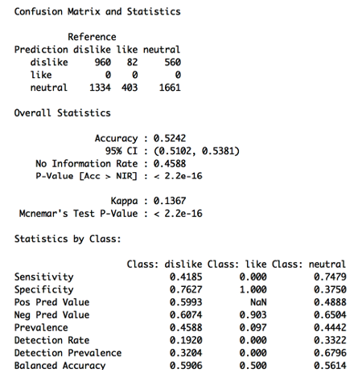 

## 5. Text Analysis
- As for the two variables artist_name and track_name, we use wordcloud2, which gives us a creative collection of clouds that generate html widgets, to do text analysis. By using this package in R, we can hover over a word to see its frequency in the text.

- From Figure below, we can see that many popular tracks names (figure on bottom) and artists names (figure on top) are shown in the two plots. Since there are 116k records in the original whole dataset and we only use 10000 records of them, the analysis results will be more accurate if we use the whole dataset for our analysis. 

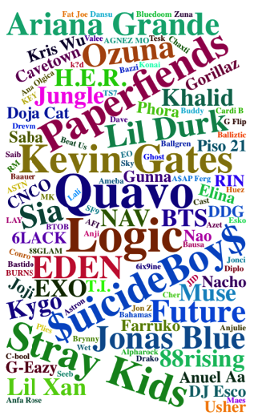 

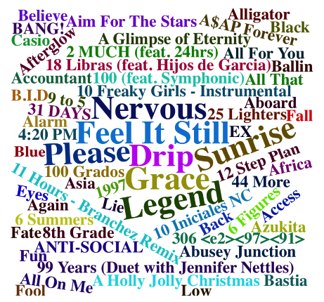 

## 6. Conclusions and Discussion
- **Modeling Summary**
  - In the modeling part, there are 5 models in total have been used for the training dataset: Linear Discriminant Analysis (LDA), Support Vector Machines (SVM), Decision Trees (CART), Random Forest (RF), k-Nearest Neighbor (kNN). 

  - Overall the k-Nearest Neighbor Model performs the worst, followed by Decision Trees. The other 3 models have pretty same level of performance. Among all these models, LDA is the best model for the training and testing dataset and has the overall highest accuracy. 

  - In the modeling process, grid search is used for parameter tuning and as there is not much accuracy difference between training and testing datasets, there is not obvious overfitting problem. From the process of selecting top 5 variables that have highest correlation with our target variable we can find this approach cannot let us get a better predictor. From several trails we find that the Linear Discriminant Analysis model has the best performance. 

  - Overall the accuracy of these 5 models are not good (less than 60%), the biggest possible reason might be all our predictors have very low correlation coefficients with our target variable, which thus lead to low prediction accuracy. Besides, the reason our models performed differently compared to the other studies can be explained in various ways. One major difference was the dataset we used. Since we chose to use a dataset containing several different genres, the dataset might have been too complex to generalize and classify. Another reason is that we randomly choose our cutoffs to divide the previous popularity value into three classes, which may lead to different prediction results. To sum up, in order to get a higher performance, there is still much work to do.

- **Conclusion**

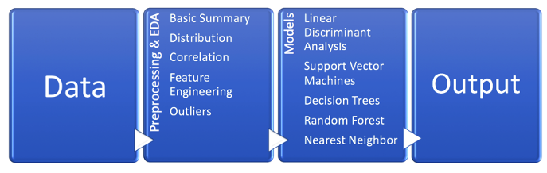 

The whole process of what we have done for this project is shown above. I started with preprocessing and exploratory data analysis, where steps such as basic summary, data cleaning, visualization and correlation analysis, dealing with outliers, feature analysis and engineering are included in this section and data are well prepared for modeling. Then I tried many different algorithms and used the Accuracy as the main evaluation for model performance. Finally, model with the best performance on the training data set is chosen and then is used to get the final prediction results for testing dataset. Besides, text analysis are done based on the artist names and track names.

The aim of this work was to further investigate whether or not it is possible to use machine learning techniques to predict hot songs. Our work could not confirm that it is possible, although other research has shown more promising results. The reason to our results are due to the dataset we selected and the models we built. The dataset we used is very diverse thus possibly making it difficult for the models to generalize and classify the data. 

There are a number of improvements that would need to be taken into consideration for future research within this field. One improvement would be to use more features than we did in our research. We believe that including more metadata such as genre, label, lyrics, and artist popularity would improve the accuracy of the models considerably. Another improvement would be to do feature selection and model optimization. Lastly, it would be favorable to define what a hot song is in a more explicit way.
