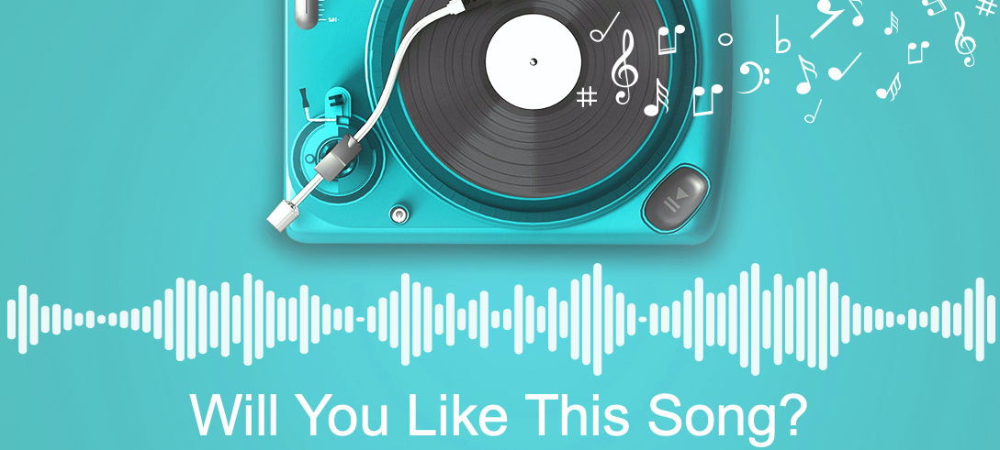
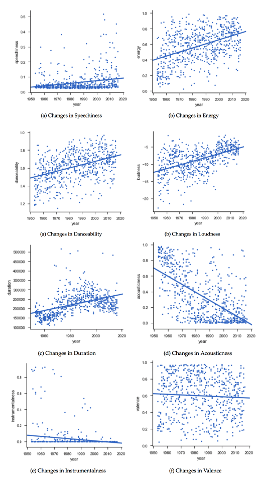
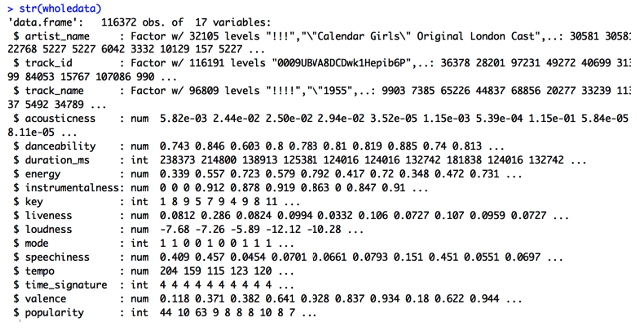

# Predicting Song Popularity

## Introduction
Predicting song popularity is particularly important in keeping businesses  competitive  within  a  growing  music  industry.  There are multiple factors that affect a song’s popularity that can be both related and unrelated to a song’s musicality, from the key and modality in which it’s written, to the name of the artist, year of release, and type of marketing campaign. But  what  exactly  makes  a  song  popular?  Starting  with the  Spotify  Songs  Dataset,  a  collection  of  audio  features  and metadata  for  huge number of  songs,  we attempted to build machine learning models to predict a song’s popularity based only on its musicality features. We  also evaluated different algorithms on their ability to  predict  popularity  and  determined  the  types  of  features  that hold  the  most  predictive  power.  

## Table of Contents
- Motivation and Problem Statement
- Data Collection
- Data Analysis 
- Modeling
- Conclusions and Discussion

## 1. Motivation and Problem Statement
- **Motivation**
  - Music has been an integral part of our culture all through-out  human  history. In 2017, the music industry generated $8.72 billion in the United States alone. Of this $8.72 billion, the majority of the revenue is generated by popular, mainstream songs. Thanks to growing streaming services (Spotify, Apple Music, etc.) the industry continues to flourish. Popular songs secure the lion’s share of revenue. The top 10 artists in 2016 generated a combined $362.5 million in revenue. Therefore, having a fundamental understanding of what makes a song popular has major implications to businesses that thrive on popular music, namely radio stations, record labels, and digital and physical music marketplaces. Besides, the  ability  to  make  accurate  predictions  of  song  popularity  also  has  implications  for  customized  music  suggestions. Predicting  popular  songs  can  be  applied  to  the  problem  of predicting preferred songs for a given population.

- **Problem Statement**
  - Every song has key characteristics including lyrics, duration, artist information, temp, beat, loudness, chord, etc. The aim of this project is to investigate the following questions: 
    - Are there certain characteristics for popular songs?
    - What are the largest influencers on a song’s success?
    - Is it possible to predict popular songs with machine learning using audio features? What is the best performance of our machine learning models?

If there’s one thing I can’t live without, it’s music. I love music and especially pop music. My inspiration for this project is finding out what it is about a song that I enjoy so much.

## 2. Data Collection
- **Data Source**
  - It can be worth mentioning what The Echo Nest is, since many of the related works used this for obtaining data about audio features. The Echo Nest is a leading music intelligence company that has over a trillion data points on over 38 million songs in its database. In 2014, Spotify announced that they had acquired The Echo Nest. Some of the audio features derived by The Echo Nest for audio tracks are still available through the Spotify API. The dataset of audio features used in this project is from Kaggle Dataset, which is fetched from Spotify’s Web API. 
  - Spotify for Developers offers a wide range of possibilities to utilize the extensive catalog of Spotify data. One of them are the audio features calculated for each song and made available via the official Spotify Web API. Each song from Spotify API has values for artist name, track name, track id and the audio features itself. 
  - There are several datasets on Kaggle published in the past containing similar data. In this project we chose data Collected on December 2018 as this dataset is the biggest one (more than 116k unique songs). Therefore, combined all the information we have got, this dataset met our criteria (good and “professional” data source, audio features with high variety, etc.), and hence is chosen for my project.

- **Audio Features Change Over Time**
  - We need to keep in mind that the audio features of hit songs differ over the decades and the results for our project may not stand for the trend of popular songs forever. To visualize this, Minna and Philippa created diagrams in which they plotted how the different features for song tracks has changed over time. The data is based on the Billboard Hot 100 tracks from 1951 until today, and the audio features are fetched from the Spotify API.

## 3. Data Analysis 
- **Basic Data Summary**
  - The original dataset contains audio features for 116k tracks collected from the official Spotify Web API. In this project, we used a subset of the Spotify songs dataset (10000 tracks). The subset included the following 17 attributes taken directly from the Spotify API:

